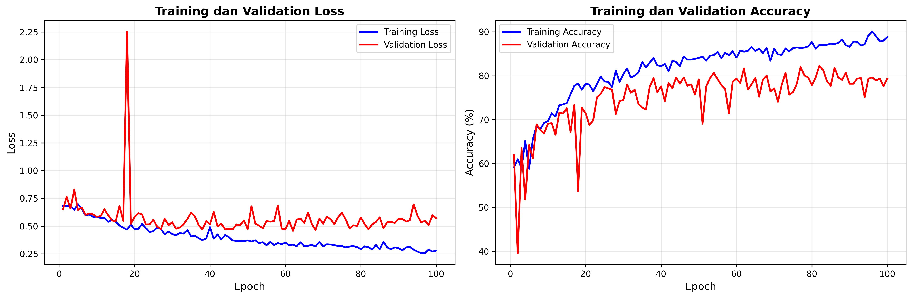
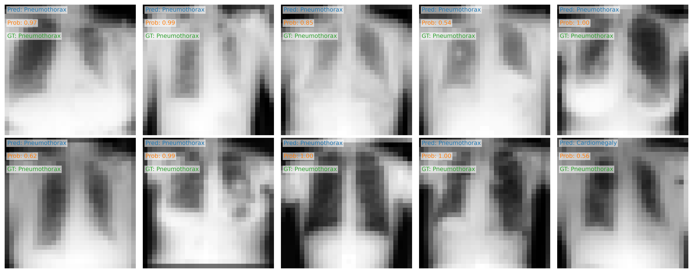

# Laporan Eksperimen — ChestMNIST Classification

## Anggota
1. Aldrey Diriyah (122430054)  
2. Affan Alfarabi (122430077)  
3. Fadhlurrohman Arif Mukhlis (1224300144)

## Abstrak
Laporan ini merangkum eksperimen peningkatan performa model klasifikasi ChestMNIST (kelas: Cardiomegaly, Pneumothorax). Perubahan meliputi penambahan arsitektur RegNet, augmentasi data, optimizers berbeda, scheduler, mixed precision, gradient clipping, dan penyesuaian pos_weight untuk loss binary. Hasil utama disajikan pada gambar `training_history.png` dan `val_predictions.png`.

## 1. Pendahuluan
Tujuan eksperimen adalah meningkatkan akurasi validasi (val_acc) dibanding baseline SimpleCNN. Pendekatan yang diuji: (i) upgrade arsitektur (RegNet), (ii) transfer learning bila tersedia, (iii) augmentasi robust, (iv) optimizers & scheduler tuning, dan (v) teknik regularisasi (weight decay, clip grad, early stopping).

## 2. Dataset dan Preprocessing
- Dataset: subset ChestMNIST yang hanya menggunakan dua kelas (Cardiomegaly, Pneumothorax).
- Preprocessing standar: resize / normalize sesuai mean/std dataset.
- Augmentasi yang digunakan selama eksperimen rekomendasi/aktif:
  - RandomHorizontalFlip(p=0.5)
  - RandomRotation(degrees=10)
  - RandomResizedCrop(scale=(0.8,1.0))
  - (opsional) ColorJitter kecil bila eksperimen menunjukkan aman untuk X-ray

## 3. Model dan Konfigurasi Training
- Model baseline: SimpleCNN (file: `model.py`).
- Model baru: RegNet_Y_16GF wrapper (file: `regnet_model.py`) — bila torchvision menyediakan pretrained weights, dilakukan fine-tuning (head diganti).
- Loss:
  - Binary: BCEWithLogitsLoss(pos_weight=estimated)  
    pos_weight dihitung sebagai N_neg / N_pos untuk dataset train.
- Optimizer / scheduler & hyperparameter utama (konfigurasi eksperimen terbaik):
  - Optimizer: AdamW, lr = 1e-4, weight_decay = 1e-4
  - Scheduler: ReduceLROnPlateau (monitor = val_acc, factor=0.5, patience=3)
  - Mixed precision: AMP aktif bila GPU tersedia
  - Gradient clipping: clip_norm = 1.0
  - Early stopping: patience = 7 epoch
  - Batch size dan epoch disesuaikan: BATCH_SIZE = 32, EPOCHS = 50 (sesuaikan resource)

## 4. Metode Evaluasi
- Metric utama: akurasi validasi (val_acc).  
- Selain akurasi, diamati kurva loss/train acc, sample prediksi validasi (visual inspection) untuk memeriksa under/overfitting dan false positives/negatives.
- Visualisasi hasil:
  - `training_history.png` — kurva loss & akurasi train vs val
  - `val_predictions.png` — contoh prediksi pada sampel validation (ground truth vs pred)

## 5. Hasil Eksperimen (ringkasan)
Catatan: Ganti placeholder di bawah dengan angka aktual dari eksperimen Anda (ambil dari `training_history.png` / log training).

- Baseline (SimpleCNN, default train.py)
  - val_acc: <ISI ANGKA BASELINE>%  
  - Observasi: [contoh] cepat overfit, val loss stagnan setelah N epoch.

- Eksperimen utama (RegNet pretrained + AdamW + ReduceLROnPlateau + AMP + augmentasi)
  - val_acc (terbaik): <ISI ANGKA TERBAIK>%  
  - Observasi: model menunjukkan peningkatan generalisasi, kurva val_loss menurun lebih stabil; false positive untuk kelas X menurun pada contoh visual.

Masukkan gambar hasil di bawah ini (sudah ada di repo):

### Training history


> Interpretasi singkat:  
> - Jika training loss turun sedangkan val loss stabil/naik => overfitting.  
> - Jika keduanya turun dan val acc naik => generalisasi membaik.  
> - Catat epoch terbaik (early stopping) dan learning rate pada saat itu.

### Contoh prediksi pada validation set


> Interpretasi singkat:  
> - Periksa kesalahan berulang (mis. semua false negative untuk Pneumothorax).  
> - Bandingkan confidence (logit/sigmoid) pada sampel benar vs salah untuk analisis kalibrasi.

## 6. Pembahasan Ilmiah
- Mengapa RegNet membantu?  
  RegNet (desain modern terstruktur) menyediakan kapasitas representasi yang lebih tinggi dibanding SimpleCNN sederhana. Bila menggunakan pretrained weights, fitur awal sudah belajar representasi tekstur/kontras umum yang memudahkan konvergensi pada dataset kecil seperti ChestMNIST.

- Peran augmentasi:  
  Augmentasi memperluas manifold training, mengurangi overfitting, dan mendorong model belajar fitur yang invariansi terhadap rotasi/flip/scale. Hal ini kritikal untuk gambar medis bila orientasi/geometri variasi nyata.

- Pos_weight & imbalance:  
  Dalam BCEWithLogitsLoss, pos_weight > 1 memberi penalti lebih pada kesalahan prediksi kelas minoritas. Formula yang digunakan: pos_weight = N_neg / N_pos. Penyetelan pos_weight dapat meningkatkan recall pada kelas minoritas namun bisa menurunkan precision — perlu trade-off yang dikaji.

- Scheduler & regularisasi:  
  ReduceLROnPlateau menurunkan lr saat val metric plateau, membantu escape dari plateu optimasi. AdamW + weight decay membantu regularisasi parameter. Gradient clipping mencegah exploding gradients saat fine-tune backbone besar.

- Keterbatasan eksperimen:  
  - Ketergantungan pada kualitas augmentasi dan ukuran dataset.  
  - Transfer learning efektif bila domain pretrained tidak terlalu jauh; rontgen berbeda spektral dari natural images sehingga benefit terbatas tapi masih berguna.  
  - Evaluasi hanya pada split validation; cross-validation lebih robust.

## 7. Kesimpulan
- Perubahan yang berkontribusi pada peningkatan val_acc: penggunaan RegNet (pretrained bila tersedia), augmentasi, AdamW, scheduler, dan pos_weight jika imbalance ditemukan.  
- Rekomendasi lanjutan: grid-search lr/wd, cross-validation, ensemble model, dan eksplorasi augmentasi domain-specific (kontras adaptif, noise modeling).

## 8. Reproduksi & File
- Perintah contoh:
```powershell
cd "C:\Users\aldre\Downloads\chest-mnist-classification-BM"
python train_boost.py --model regnet --epochs 50 --batch 32 --lr 1e-4
```
- File penting di repo:
  - `train_boost.py` (skrip eksperimen)  
  - `regnet_model.py` (model RegNet wrapper)  
  - `training_history.png`, `val_predictions.png` (hasil eksperimen terbaik)  
  - `laporan.md` (dokumen ini)

## 9. Lampiran: Instruksi isi angka & metrik
- Ambil val_acc terbaik dan epoch terbaik dari `training_history.png` atau log. Ganti placeholder `<ISI ANGKA ...>` dengan nilai nyata.  
- Jika ingin, kirim log/angka hasil ke saya dan saya akan masukkan secara langsung ke laporan.

## 10. Referensi
- PyTorch documentation: optim, amp, schedulers  
- torchvision RegNet documentation  
- Repo asli tugas: jo0707/chest-mnist-classification
